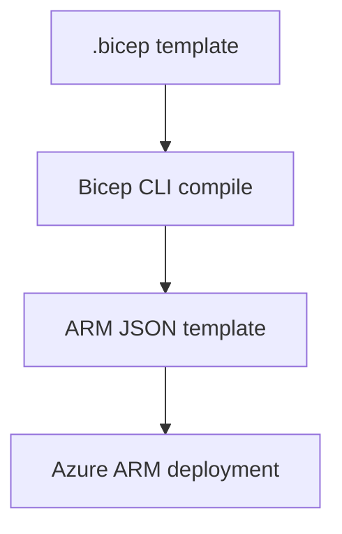
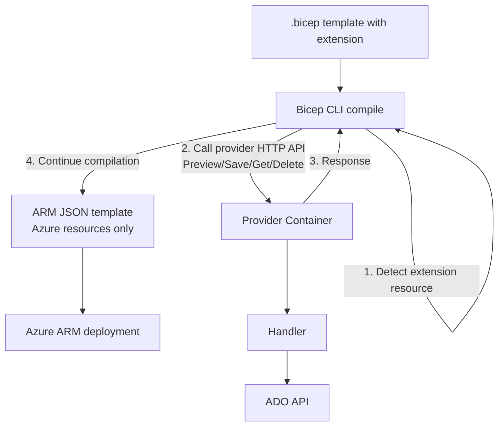
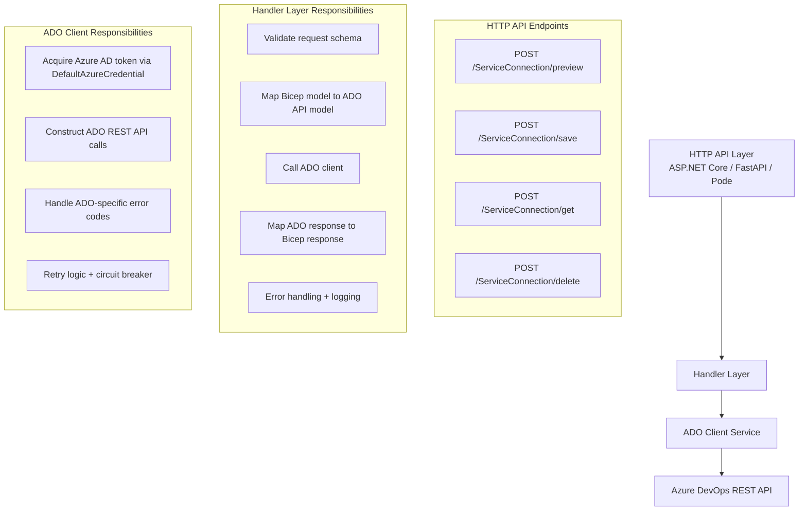
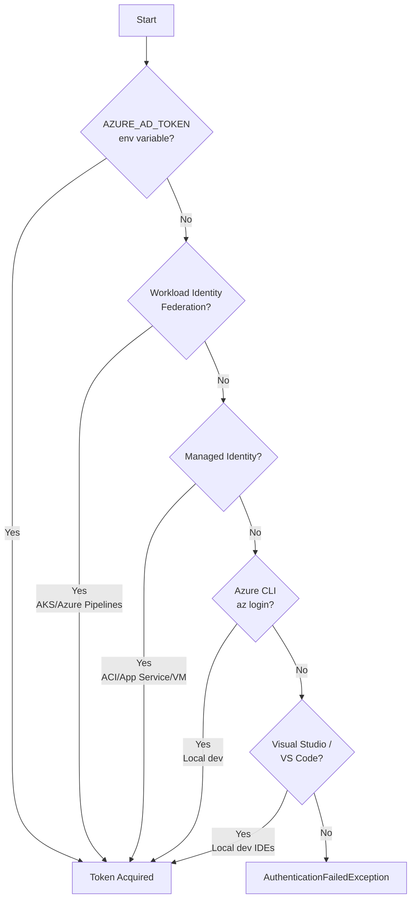
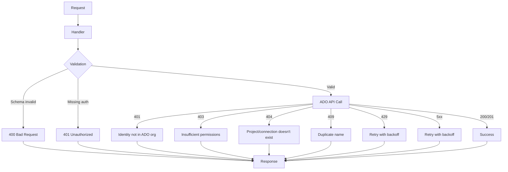

# Architecture Guide

## Overview

ITL.Bicep.Extensions.AzureDevOps is a **Bicep extensibility provider** that implements the [Bicep Extensibility V2 Protocol](https://github.com/Azure/bicep-extensibility). It acts as a bridge between Bicep templates and Azure DevOps APIs, allowing you to manage Azure DevOps resources using declarative Infrastructure-as-Code.

## How Bicep Extensibility Works

### Traditional Bicep Deployment Flow



### Extensibility Provider Flow



**Key insight**: Extension resources are processed **client-side** during Bicep compilation. The Azure ARM deployment never sees the Azure DevOps resources — they are created directly via the provider before the Azure deployment starts.

## Component Architecture

### Provider Components



## Authentication Flow

### DefaultAzureCredential Chain

The provider uses **Azure Identity SDK** (`DefaultAzureCredential`) which tries the following credential sources in order:



### Token Acquisition

Once a credential is selected, the provider requests an Azure AD token with:

- **Resource ID**: `499b84ac-1321-427f-aa17-267ca6975798` (Azure DevOps)
- **Scopes**: `499b84ac-1321-427f-aa17-267ca6975798/.default`

This token is then used as `Authorization: Bearer {token}` in all Azure DevOps REST API calls.

### Required Permissions

The identity (service principal, managed identity, or user) must:

1. **Be a member of the Azure DevOps organization**
   - Navigate to: `https://dev.azure.com/{org}/_settings/users`
   - Add the identity (use Object ID for service principals)

2. **Have "Service Connections" permissions**
   - Organization-level: **Service Connections: Read & manage**
   - Project-level: **Administrator** or **Creator** role on the service connections security group

> ⚠️ **Common mistake**: Having Azure RBAC roles (e.g., Contributor on a subscription) is **not sufficient**. The identity must be explicitly added to the ADO organization.

## Resource Lifecycle

### Preview Operation

**Purpose**: Validate the resource configuration without making changes.

```
Bicep CLI → POST /ServiceConnection/preview
           {
             "type": "ServiceConnection@2024-01-01",
             "identifiers": { "organization": "...", "project": "...", "name": "..." },
             "properties": { ... }
           }
           
Provider → Validate schema
         → Check if service connection exists (GET call to ADO)
         → Return { "status": "valid" } or { "error": "..." }
```

**When called**:
- During `bicep build` (template validation)
- During `az deployment ... --what-if` (dry run)

### Save Operation (Create or Update)

**Purpose**: Create a new service connection or update an existing one.

```
Bicep CLI → POST /ServiceConnection/save
           { ...resource definition... }
           
Provider → Check if service connection exists:
           GET https://dev.azure.com/{org}/{project}/_apis/serviceendpoint/endpoints/{id}
           
         → If NOT EXISTS:
           POST https://dev.azure.com/{org}/{project}/_apis/serviceendpoint/endpoints
           { "name": "...", "type": "...", "authorization": {...}, ... }
           
         → If EXISTS:
           PUT https://dev.azure.com/{org}/{project}/_apis/serviceendpoint/endpoints/{id}
           { ...updated properties... }
           
         → Return { "properties": { ...created/updated resource... } }
```

**Idempotency**: The operation is idempotent — re-running the same Bicep deployment multiple times is safe. The provider:
- Uses the `name` identifier to check for existing connections
- Performs a PUT (update) if found, POST (create) if not found
- Ensures no duplicate connections are created

### Get Operation

**Purpose**: Retrieve the current state of a service connection.

```
Bicep CLI → POST /ServiceConnection/get
           { "identifiers": { "organization": "...", "project": "...", "name": "..." } }
           
Provider → GET https://dev.azure.com/{org}/{project}/_apis/serviceendpoint/endpoints
           ?endpointNames={name}
           
         → Return { "properties": { ...current state... } }
           OR
         → Return { "status": "NotFound" } if deleted
```

**When called**:
- Rarely — Bicep typically calls Preview and Save during deployment
- Can be invoked manually via direct HTTP call for debugging

### Delete Operation

**Purpose**: Remove a service connection.

```
Bicep CLI → POST /ServiceConnection/delete
           { "identifiers": { "organization": "...", "project": "...", "name": "..." } }
           
Provider → Find service connection by name
         → DELETE https://dev.azure.com/{org}/{project}/_apis/serviceendpoint/endpoints/{id}
         → Return { "status": "Deleted" }
```

**When called**:
- When the resource is removed from the Bicep template and re-deployed
- **Note**: Bicep does not automatically delete resources when removed from template — you must explicitly deploy with the resource absent or use `az deployment ... --mode Complete`

## Error Handling

### Provider Error Flow



### Common Error Scenarios

| HTTP Status | Bicep Error | Cause | Solution |
|---|---|---|---|
| 401 Unauthorized | `ExtensionError: 401` | Identity not a member of ADO org | Add service principal/MI to `https://dev.azure.com/{org}/_settings/users` |
| 403 Forbidden | `ExtensionError: 403` | No "Service Connections" permission | Grant "Read & manage" or "Administrator" role |
| 404 Not Found | `ExtensionError: 404` | Project doesn't exist | Verify project name spelling |
| 409 Conflict | `ExtensionError: 409` | Name conflict (rare) | Choose a different connection name |
| 500 Internal Server Error | `ExtensionError: 500` | Provider crash or ADO outage | Check provider logs; retry deployment |

## Data Flow Example

### Complete Create Flow

```
1. User runs:
   az deployment group create --template-file main.bicep ...

2. Bicep CLI parses template, finds extension resource:
   extension ado
   resource conn 'ServiceConnection@2024-01-01' = { ... }

3. Bicep CLI reads bicepconfig.json:
   "extensions": {
     "ado": "br:myacr.azurecr.io/extensions/itl-azuredevops:1.0.0"
   }

4. Bicep CLI pulls the extension metadata from the OCI artifact
   (contains HTTP endpoint: http://localhost:8080)

5. Bicep CLI calls the provider:
   POST http://localhost:8080/ServiceConnection/preview
   { "type": "ServiceConnection@2024-01-01", ... }
   
   Response: { "status": "valid" }

6. Bicep CLI calls the provider again:
   POST http://localhost:8080/ServiceConnection/save
   { "type": "ServiceConnection@2024-01-01", ... }

7. Provider:
   - Acquires Azure AD token via DefaultAzureCredential
   - Calls: GET https://dev.azure.com/itlusions/my-project/_apis/serviceendpoint/endpoints?endpointNames=my-conn
   - Response: 404 Not Found (doesn't exist yet)

8. Provider:
   - Calls: POST https://dev.azure.com/itlusions/my-project/_apis/serviceendpoint/endpoints
   - Body: { "name": "my-conn", "type": "AzureRM", "authorization": {...}, ... }
   - Response: 201 Created with connection ID

9. Provider returns to Bicep CLI:
   { "properties": { "id": "12345-...", "name": "my-conn", ... } }

10. Bicep CLI continues compilation, removes extension resource from ARM template

11. az deployment continues with ARM template (Azure resources only)

12. Deployment complete ✅
```

## Performance Considerations

### Parallelization

Bicep processes extension resources **sequentially** during template compilation. If you have 10 service connections in one template:

- **Sequential**: ~10-15 seconds (1-1.5s per connection)
- **Not parallel**: Bicep does not parallelize extension calls in the same template

**Optimization strategies**:
- Split large templates into modules if deployment time is critical
- Use separate deployments for bulk connection creation
- Consider using the provider's HTTP API directly for bulk operations

### Caching

The provider does not cache Azure AD tokens or ADO API responses. Each operation:
- Acquires a fresh token (cached internally by Azure Identity SDK for ~45 min)
- Makes live calls to Azure DevOps APIs

This ensures consistency but means:
- Network latency affects performance
- ADO API rate limits apply (rare for typical usage)

## Security Model

### Token Storage

- Tokens are **never** written to disk by the provider
- Azure Identity SDK may cache tokens in memory (~45 min TTL)
- No logs contain full tokens (only last 4 characters in debug logs)

### Secret Management

For service connection types that require secrets (e.g., `ServicePrincipal` scheme with client secret):

- **DO**: Pass secrets via Bicep `@secure()` parameters
- **DO**: Store secrets in Azure Key Vault; reference in Bicep
- **DON'T**: Hardcode secrets in `.bicep` files
- **DON'T**: Log secrets in provider code

Example secure pattern:

```bicep
@secure()
param clientSecret string

resource conn 'ServiceConnection@2024-01-01' = {
  properties: {
    authorization: {
      scheme: 'ServicePrincipal'
      parameters: {
        tenantid: tenantId
        serviceprincipalid: spId
        serviceprincipalkey: clientSecret  // 🔒 Never logged
      }
    }
  }
}
```

### Network Security

The provider must be network-accessible from the machine running `az deployment`:

- **Local dev**: `http://localhost:8080`
- **CI/CD**: Service container in the same network/job
- **Production**: Private endpoint, VNet integration, or public endpoint with firewall rules

**Recommendation**: Do **not** expose the provider to the public internet. Use:
- Azure Container Instances with VNet integration
- AKS with internal load balancer
- App Service with VNet integration + Private Endpoint

## Observability

### Logging

All three implementations emit structured logs:

- **.NET**: `ILogger<T>` → JSON console output
- **Python**: `logging` → JSON console output
- **PowerShell**: `Write-Host` with structured format

**Log levels**:
- **INFO**: Successful operations, token acquisition
- **WARNING**: Retries, non-fatal errors
- **ERROR**: Failed operations, authentication failures

Example log entry (.NET):

```json
{
  "timestamp": "2024-05-09T12:34:56.789Z",
  "level": "Information",
  "message": "Service connection created",
  "organization": "itlusions",
  "project": "my-project",
  "connectionName": "my-conn",
  "connectionId": "12345-...",
  "durationMs": 1234
}
```

### Metrics

The .NET implementation exposes Prometheus metrics on `/metrics` (if enabled):

- `bicep_extension_requests_total` (counter)
- `bicep_extension_request_duration_seconds` (histogram)
- `bicep_extension_ado_api_calls_total` (counter)
- `bicep_extension_authentication_failures_total` (counter)

### Tracing

The .NET implementation supports OpenTelemetry tracing (if configured). Each request generates a trace with spans:

1. `HTTP POST /ServiceConnection/save`
2. `Acquire Azure AD token`
3. `GET ADO service connection`
4. `POST ADO service connection`
5. `Map response`

Export traces to Azure Application Insights, Jaeger, or Zipkin for distributed tracing.

## Deployment Patterns

See [DEPLOYMENT.md](DEPLOYMENT.md) for detailed production deployment patterns including:

- Azure Container Instances (ACI)
- Azure Kubernetes Service (AKS)
- Azure App Service
- Azure Pipelines service containers
- GitHub Actions service containers
