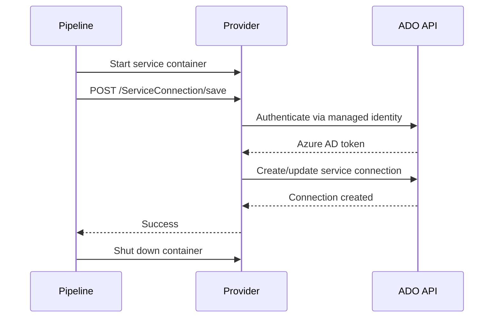

# Quick Start Guide

Get the ITL Bicep Azure DevOps extensibility provider running in 5 minutes using CI/CD service containers.

**No dedicated server needed!** The provider runs as a service container in your pipeline — zero infrastructure to manage.

## Prerequisites

- Azure DevOps organization (free tier works)
- GitHub or Azure Pipelines
- Bicep CLI 0.29+ (`az bicep version`)
- An identity with "Service Connections: Read & manage" permission in your ADO org

## Step 1: Add Identity to Azure DevOps

The pipeline's managed identity must be a member of your Azure DevOps organization:

1. Go to `https://dev.azure.com/{your-org}/_settings/users`
2. Click **Add users**
3. Paste the **Object ID** of your service principal or managed identity
4. Assign **Basic** access level
5. Click **Add**

**Find Object ID:**
```bash
# Service principal
az ad sp show --id <client-id> --query id -o tsv

# Managed identity
az identity show --name <mi-name> --resource-group <rg> --query principalId -o tsv
```

## Step 2: Create Bicep Template

Create `connections/main.bicep`:

```bicep
extension ado

@description('Azure DevOps organization')
param organization string = 'your-org'

@description('Project name')
param project string = 'your-project'

@description('Azure subscription ID')
param subscriptionId string

@description('Azure tenant ID')
param tenantId string

@description('Service principal client ID')
param servicePrincipalId string

// Azure connection with Workload Identity Federation (no secrets!)
resource azureConnection 'ServiceConnection@2024-01-01' = {
  identifiers: {
    organization: organization
    project: project
    name: '${project}-azure-prod'
  }
  properties: {
    name: '${project}-azure-prod'
    type: 'AzureRM'
    url: 'https://management.azure.com/'
    authorization: {
      scheme: 'WorkloadIdentityFederation'
      parameters: {
        tenantid: tenantId
        serviceprincipalid: servicePrincipalId
      }
    }
    data: {
      subscriptionId: subscriptionId
      subscriptionName: 'Production'
      environment: 'AzureCloud'
      scopeLevel: 'Subscription'
      creationMode: 'Manual'
    }
  }
}

output connectionId string = azureConnection.properties.id
```

## Step 3: Configure Bicep Extension

Create `connections/bicepconfig.json`:

```json
{
  "experimentalFeaturesEnabled": {
    "extensibility": true
  },
  "extensions": {
    "ado": "http://localhost:8080"
  }
}
```

**Note**: Use `http://localhost:8080` for GitHub Actions, `http://ado_provider:8080` for Azure Pipelines.

## Step 4: Add Pipeline

### Option A: GitHub Actions

Create `.github/workflows/deploy-connections.yml`:

```yaml
name: Deploy Service Connections

on:
  push:
    branches: [main]

jobs:
  deploy:
    runs-on: ubuntu-latest
    
    # Provider runs as service container
    services:
      ado-provider:
        image: ghcr.io/itlusions/itl-ado-provider:latest
        ports:
          - 8080:8080
    
    steps:
    - uses: actions/checkout@v4
    
    - name: Azure Login
      uses: azure/login@v1
      with:
        creds: ${{ secrets.AZURE_CREDENTIALS }}
    
    - name: Deploy Connections
      run: |
        cd connections
        az deployment group create \
          --resource-group my-rg \
          --template-file main.bicep \
          --parameters \
            organization=your-org \
            project=your-project \
            subscriptionId=${{ secrets.AZURE_SUBSCRIPTION_ID }} \
            tenantId=${{ secrets.AZURE_TENANT_ID }} \
            servicePrincipalId=${{ secrets.AZURE_CLIENT_ID }}
```

### Option B: Azure Pipelines

Create `azure-pipelines.yml`:

```yaml
trigger:
  branches:
    include:
    - main

pool:
  vmImage: 'ubuntu-latest'

# Provider runs as service container
resources:
  containers:
  - container: ado_provider
    image: ghcr.io/itlusions/itl-ado-provider:latest
    ports:
    - 8080:8080

services:
  ado_provider: ado_provider

steps:
- task: AzureCLI@2
  inputs:
    azureSubscription: 'your-azure-connection'
    scriptType: 'bash'
    scriptLocation: 'inlineScript'
    inlineScript: |
      cd connections
      
      # Update bicepconfig to use service container name
      cat > bicepconfig.json <<EOF
      {
        "experimentalFeaturesEnabled": { "extensibility": true },
        "extensions": { "ado": "http://ado_provider:8080" }
      }
      EOF
      
      az deployment group create \
        --resource-group my-rg \
        --template-file main.bicep \
        --parameters \
          organization=your-org \
          project=your-project \
          subscriptionId=$(az account show --query id -o tsv) \
          tenantId=$(az account show --query tenantId -o tsv) \
          servicePrincipalId=$(az account show --query user.name -o tsv)
```

## Step 5: Run Pipeline

Push your code and watch the pipeline:

1. Provider spins up as service container
2. Bicep CLI calls provider to create/update service connection
3. Provider shuts down when pipeline completes

**That's it!** Your service connection is now managed as code.

## Verify

Check your Azure DevOps project:

1. Go to `https://dev.azure.com/{org}/{project}/_settings/adminservices`
2. You should see `{project}-azure-prod` in the list

## What's Happening Under the Hood?



## Next Steps

- **Add more connections**: GitHub, Docker Registry → [API Reference](API-REFERENCE.md)
- **Secure secrets**: Use Key Vault for PATs → [API Reference § Best Practices](API-REFERENCE.md#best-practices)
- **Production setup**: Deploy to AKS, ACI → [Deployment Guide](DEPLOYMENT.md)
- **Troubleshoot**: Fix auth errors → [Troubleshooting](TROUBLESHOOTING.md)

## Common Issues

**401 Unauthorized**: Identity not in ADO org → Go back to Step 1

**Connection refused**: Check `bicepconfig.json` endpoint matches your CI/CD platform:
- GitHub Actions: `http://localhost:8080`
- Azure Pipelines: `http://ado_provider:8080`

**More issues?** See [Troubleshooting](TROUBLESHOOTING.md).

---

**Questions?** Open an [issue](https://github.com/ITlusions/ITL.Bicep.Extensions.AzureDevOps/issues).
